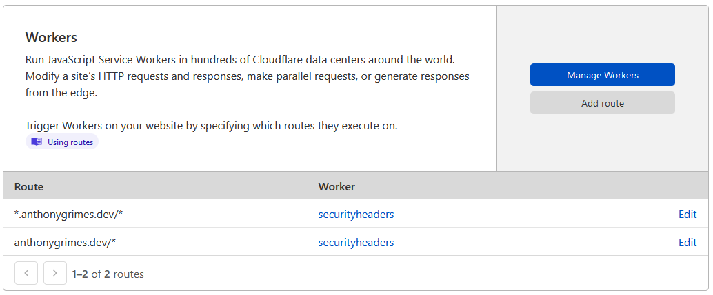

# cfworkers-security-headers

A [Cloudflare Workers](https://workers.cloudflare.com/) project which adds sensible security header rewrites.

## getting started

### via wrangler-cli

1. Rename the `wrangler.toml.example` to `wrangler.toml` and supply at minimum your `account_id`
    1. If you want to deploy to a specific zone or route you will have to supply the required `zone_id` and `route`
1. Run `wrangler publish` from within the project directory to deploy the Cloudflare Worker to your desired zone
    1. If you are deploying to your default zone and wish to use the worker in one of your sites, you will have to
       manually add the routes like so in the workers panel in your domain dashboard.
       

